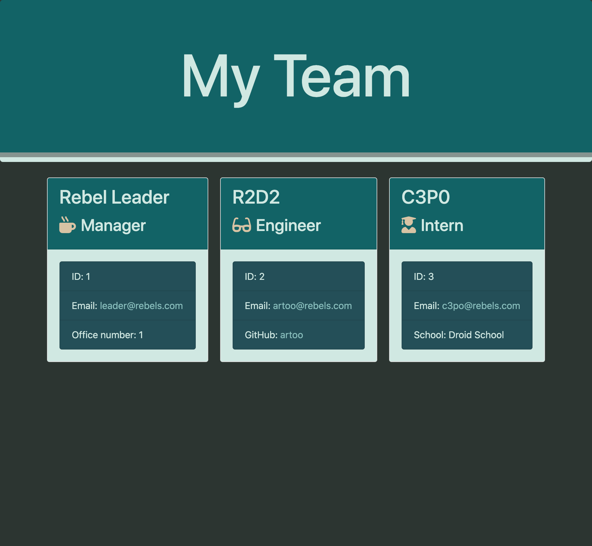

# Team Builder

    
## Table of Contents
==================
* [Description](#Description) 
* [Installation](#Installation)
* [Usage](#Usage) 
* [license](#license) 
* [Questions](#Questions)

==================
    
## Description
    
Team Builder is a Node CLI program used to help managers build a smiple website for thier teams with information about each employee.
    
## Installation
    
To run the program make sure you have NPM installed by running NPM init then use npm i inquirer. Once installed run node app.js and prompts will be provided to help generate your team.html. You will find your finished team.html in the output folder. a style.css file is saved in the templates folder to use as well to style your page.
    
## Usage

You can use this html file and attached style sheet to use as an easy way to display your team information.
### Sample of Page generated with app.

[Link to video walkthrough](https://drive.google.com/file/d/1ON2husCN4CGTJpYFSLJoaKpUAfYlXEkC/view)

### license

This application is covered under the MIT License. Please see any additional files in GitHub for details. 

### Questions

If you have any questions please contact at [beccaablanton@gmail.com](beccaablanton@gmail.com)

[Link to GitHub Profile](https://www.github.com/BeccaBlanton)

